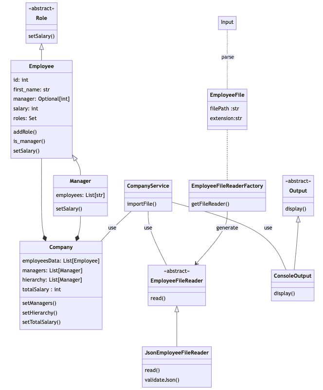

## Project diagram  

## Extensible and reusable program design:
- Possible to add multiple roles to each employee:   
  All people in a company are employees, yet some are managers, thus abstract class `Role` is designed for creating different roles in the company. Each role can have different setSalary() implementations. When we want to specify a new role to an employee, we can simply do `employee_mary.addRole(Manager)`
- Extensibility for reading different file formats:   
  `EmployeeFileReaderFactory` creates the correct `fileReader` at runtime based on the extension type of `EmployeeFile`. Inside this project, we have one `JsonEmployeeFileReader` but we are open to other extensions such as `YMALEmployeeFileReader`, which can have the same 'read()' behaviour implemented differently.
- Allow adding more display layout:  
  To display employee hierarchy, the abstract class `Output` has one child class `ConsoleOutput` that implements the `display()` for printing company info, this definition can be beneficial if a new requirement of `FileOutput` come up in the future.
## Result:

## How to run:
> unzip IMN_Coding_Challenge.zip  
> cd IMN_Coding_Challenge  
> python3 .  

## Dependency libraries:
pytest  
pydantic  
jsonschema